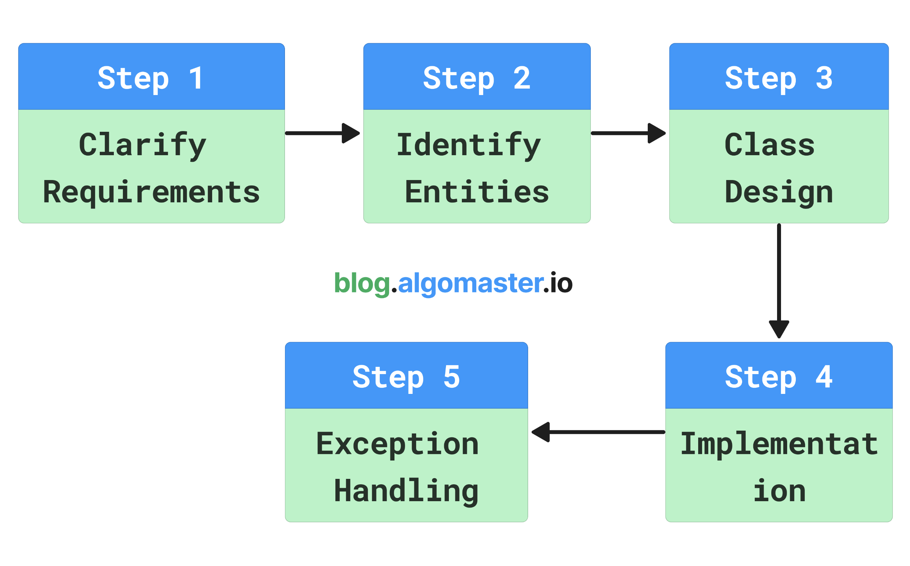

# LOW LEVEL DESIGN

## 📌 Fundamental Concepts

- [Basics OOP Concepts](https://blog.algomaster.io/p/basic-oop-concepts-explained-with-code)
- [SOLID Principles with Pictures](https://medium.com/backticks-tildes/the-s-o-l-i-d-principles-in-pictures-b34ce2f1e898)
- [SOLID Principles with Code](https://blog.algomaster.io/p/solid-principles-explained-with-code)
- [DRY Principle](https://blog.algomaster.io/p/082450d8-0e7b-4447-a8dc-b7308e45f048)
- [YAGNI Principle](https://blog.algomaster.io/p/8c3c7da7-885b-4a9c-a6e4-70ee02de4772)
- [KISS Principle](https://blog.algomaster.io/p/21b57678-b351-4ed4-b390-3b6308af2f7d)
- [Coursera - Object-Oriented Design](https://www.coursera.org/learn/object-oriented-design)

## ⚙️ Design Patterns

| **Creational Patterns**                                                       | **Structural Patterns**                                         | **Behavioral Patterns**                                                               |
| ----------------------------------------------------------------------------- | --------------------------------------------------------------- | ------------------------------------------------------------------------------------- |
| [Singleton](https://algomaster.io/learn/lld/singleton)            | [Adapter](https://algomaster.io/learn/lld/adapter)     | [Iterator](https://algomaster.io/learn/lld/iterator)                         |
| [Factory Method](https://algomaster.io/learn/lld/factory-method)     | [Bridge](https://algomaster.io/learn/lld/bridge)       | [Observer](https://algomaster.io/learn/lld/observer)                         |
| [Abstract Factory](https://algomaster.io/learn/lld/abstract-factory) | [Composite](https://algomaster.io/learn/lld/composite) | [Strategy](https://algomaster.io/learn/lld/strategy)                         |
| [Builder](https://algomaster.io/learn/lld/builder)                   | [Decorator](https://algomaster.io/learn/lld/decorator) | [Command](https://algomaster.io/learn/lld/command)                           |
| [Prototype](https://algomaster.io/learn/lld/prototype)               | [Facade](https://algomaster.io/learn/lld/facade)       | [State](https://algomaster.io/learn/lld/state)                               |
|                                                                               | [Flyweight](https://algomaster.io/learn/lld/flyweight) | [Template Method](https://algomaster.io/learn/lld/template-method)           |
|                                                                               | [Proxy](https://algomaster.io/learn/lld/proxy)         | [Visitor](https://algomaster.io/learn/lld/visitor)                           |
|                                                                               |                                                                 | [Mediator](https://algomaster.io/learn/lld/mediator)                         |
|                                                                               |                                                                 | [Memento](https://algomaster.io/learn/lld/memento)                           |
|                                                                               |                                                                 | [Chain of Responsibility](https://algomaster.io/learn/lld/chain-of-responsibility) |

## 🗂️ UML
- [Class Diagram](https://blog.algomaster.io/p/uml-class-diagram-explained-with-examples)
- [Use Case Diagram](https://blog.algomaster.io/p/119449cd-b003-46da-9e4d-0eb356d216d8)
- [Sequence Diagram](https://blog.algomaster.io/p/4dd99bdc-5c35-4a80-bc53-1777cb57aa05)
- [Activity Diagram](https://www.visual-paradigm.com/guide/uml-unified-modeling-language/what-is-activity-diagram/)
- [State Machine Diagram](https://www.visual-paradigm.com/guide/uml-unified-modeling-language/what-is-state-machine-diagram/)

## ✅ [How to Answer a LLD Interview Problem](https://blog.algomaster.io/p/how-to-answer-a-lld-interview-problem)

## 💻 Low Level Design Interview Problems
### Easy Problems

- [Design Parking Lot](problems/parking-lot.md)
- [Design Stack Overflow](problems/stack-overflow.md)
- [Design a Vending Machine](problems/vending-machine.md)
- [Design Logging Framework](problems/logging-framework.md)
- [Design Traffic Signal Control System](problems/traffic-signal.md)
- [Design Coffee Vending Machine](problems/coffee-vending-machine.md)
- [Design a Task Management System](problems/task-management-system.md)

### Medium Problems

- [Design ATM](problems/atm.md)
- [Design LinkedIn](problems/linkedin.md)
- [Design LRU Cache](problems/lru-cache.md)
- [Design Tic Tac Toe Game](problems/tic-tac-toe.md)
- [Design Pub Sub System](problems/pub-sub-system.md)
- [Design an Elevator System](problems/elevator-system.md)
- [Design Car Rental System](problems/car-rental-system.md)
- [Design an Online Auction System](problems/online-auction-system.md)
- [Design Hotel Management System](problems/hotel-management-system.md)
- [Design a Digital Wallet Service](problems/digital-wallet-service.md)
- [Design Airline Management System](problems/airline-management-system.md)
- [Design a Library Management System](problems/library-management-system.md)
- [Design a Social Network like Facebook](problems/social-networking-service.md)
- [Design Restaurant Management System](problems/restaurant-management-system.md)
- [Design a Concert Ticket Booking System](problems/concert-ticket-booking-system.md)

### Hard Problems

- [Design CricInfo](problems/cricinfo.md)
- [Design Splitwise](problems/splitwise.md)
- [Design Chess Game](problems/chess-game.md)
- [Design a Snake and Ladder game](problems/snake-and-ladder.md)
- [Design Ride-Sharing Service like Uber](problems/ride-sharing-service.md)
- [Design Course Registration System](problems/course-registration-system.md)
- [Design Movie Ticket Booking System](problems/movie-ticket-booking-system.md)
- [Design Online Shopping System like Amazon](problems/online-shopping-service.md)
- [Design Online Stock Brokerage System](problems/online-stock-brokerage-system.md)
- [Design Music Streaming Service like Spotify](problems/music-streaming-service.md)
- [Design Online Food Delivery Service like Swiggy](problems/food-delivery-service.md)

## Additional resources
- [Coursera - Design Patterns](https://www.coursera.org/learn/design-patterns)
- [Github - Awesome Design Patterns](https://github.com/DovAmir/awesome-design-patterns)
